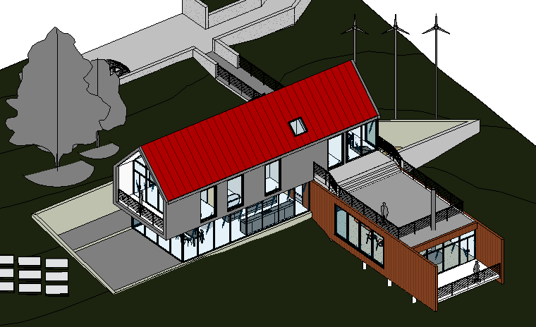
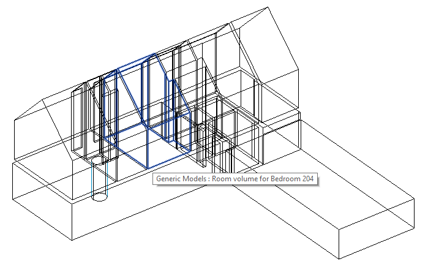

# RoomVolumeDirectShape

Revit C# .NET add-in creating DirectShape elements representing room volume.

The RoomVolumeDirectShape add-in performs the following simple steps:

- Retrieve all rooms in the BIM using a filtered element collector, then, for each room:
- Query each room for its closed shell using
the [ClosedShell API call](https://www.revitapidocs.com/2020/1a510aef-63f6-4d32-c0ff-a8071f5e23b8.htm)
- Generate a [DirectShape element](https://www.revitapidocs.com/2020/bfbd137b-c2c2-71bb-6f4a-992d0dcf6ea8.htm) representing the geometry
- Query each room for all its properties, mostly stored in parameters
(cf., [getting all parameter values](https://thebuildingcoder.typepad.com/blog/2018/05/getting-all-parameter-values.html)
and [retrieving parameter values from an element](https://thebuildingcoder.typepad.com/blog/2018/05/getting-all-parameter-values.html#5))
- Generate a JSON string representing a dictionary of the room properties
- Store the room property JSON string in the DirectShape Comment property

## Motivation

This add-in was inspired by the following request:

The context: We are building digital twins out of BIM data. To do so, we use Revit, Dynamo, and Forge.

The issue: We rely on the rooms in Revit to perform a bunch of tasks (reassign equipment localization, rebuild a navigation tree, and so on).

Unfortunately, theses rooms are not displayed in the Revit 3D view.

Therefore, they are nowhere to be found in the Forge SVF file.

Our (so-so) solution: The original solution was developed with Autodesk consulting.

We use Dynamo to extract the room geometry and build Revit volumes.

It works, but it is:

- Not very robust: Some rooms has to be recreated manually, Dynamo crashes, geometry with invalid faces is produced, etc.
- Not very fast: The actual script exports SAT files and reimports them.
- Manual: Obviously, and also tedious and error-prone.

The whole process amounts to several hours of manual work.

We want to fix this.

Our goal: A robust implementation that will get rid of Dynamo, automate the process in Revit, and in the end, run that in a Forge Design Automation process.

The ideal way forward is exactly what you describe: A native C# Revit API that find the rooms, creates a direct shape volume for them, and copy their properties to that.

No intermediate formats, no UI, just straight automation work.

## Solution

The solution is explained in detail
in [The Building Coder](https://thebuildingcoder.typepad.com) discussion
on [`DirectShape` element to represent room volume](https://thebuildingcoder.typepad.com/blog/2019/05/generate-directshape-element-to-represent-room-volume.html).

## Sample Run

I tested this in the well-known standard Revit *rac_basic_sample_project.rvt* sample model:

Isolated, the resulting direct shapes look like this:

## Cleaning up the Solid for the Forge Viewer

The solid returned by `Room.GetClosedShell` does not display properly in the Forge viewer; in fact, the generic model direct shape elements are completely ignored and do not even appear in the Forge viewer model browser.

Implemented `CopyGeometry` to fix that, and tried various approaches to recreate the solid myself, iterating over the solid faces and building new faces with a `TessellatedShapeBuilder`.

Three approaches attemtped, using:

- `Face.Triangulate`
- `Face.EdgeLoops`
- `Face.GetEdgesAsCurveLoops`

Using the unoriented edge loops does not work. It would require reorienting the edges properly to define a valid new solid.

Using `GetEdgesAsCurveLoops` creates a good-looking solid in Revit, but it has some weird normals in the Forge viewer.

Currently, the triangulation approach seems be the only one that deliver reliable results in the Forge viewer.

## Author

Jeremy Tammik, [The Building Coder](http://thebuildingcoder.typepad.com), [ADN](http://www.autodesk.com/adn) [Open](http://www.autodesk.com/adnopen), [Autodesk Inc.](http://www.autodesk.com)

## License

This sample is licensed under the terms of the [MIT License](http://opensource.org/licenses/MIT).
Please see the [LICENSE](LICENSE) file for full details.
